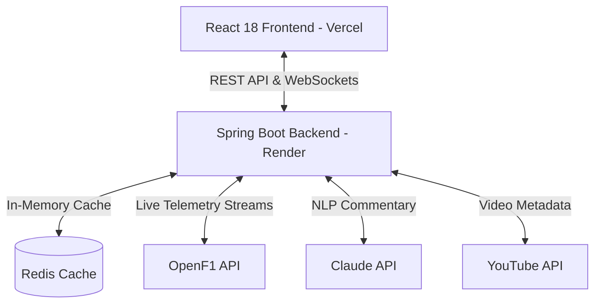

<div align="center">
  <h1>🏎️ PitWall - Formula 1 Live Dashboard</h1>
  <p><strong>A full-stack, real-time Formula 1 dashboard application delivering live race telemetry, advanced analytics, and AI-powered insights. Built for high performance, seamless data streaming, and a premium user experience.</strong></p>

  <p>
    <a href="https://pitwall-mocha.vercel.app/" target="_blank"><strong>View Live Demo</strong></a>
    ·
    <a href="#-overview">Overview</a>
    ·
    <a href="#-key-features">Features</a>
    ·
    <a href="#-system-architecture--tech-stack">Architecture</a>
    ·
    <a href="#-technical-challenges--solutions">Technical Challenges</a>
    ·
    <a href="#-getting-started">Getting Started</a>
  </p>

  <p>
    
    
    
    
    
    
  </p>

  
</div>

<hr />

## 🌟 Overview

Formula 1 produces millions of data points every second. **PitWall** is designed to process and visualize this complex telemetry in real-time. Created as a comprehensive platform for F1 enthusiasts, data analysts, and developers alike, PitWall brings the thrill of the race directly to the browser. 

Unlike standard sports scoreboards, PitWall establishes an active WebSocket connection to push live driver tracking, sector times, and AI-generated race context directly to the user. The project stands as a testament to modern full-stack development, proving how decoupled client-server architecture can be used to handle high-frequency data streams gracefully.

**Live Application:** [https://pitwall-mocha.vercel.app/](https://pitwall-mocha.vercel.app/)

## ✨ Key Features (Deep Dive)

### 🏎️ Real-time Race Telemetry & Leaderboards
At the core of PitWall is the live leaderboard. Using WebSocket streams connected to the OpenF1 API, the application renders real-time position changes, lap times, gap intervals, and tire data. 
* **Dynamic Rendering:** The frontend efficiently handles thousands of state updates per minute without jank, updating only the specific driver rows that change.

### 🤖 Context-Aware AI Commentary
To make the raw data digestible, PitWall integrates Claude AI to generate dynamic, human-like race commentary. 
* **How it works:** The Spring Boot backend continually aggregates race events (overtakes, pit stops, yellow flags) and periodically feeds these structured events to the Claude API. Claude then responds with engaging broadcast-style commentary, pushed to the client via WebSockets.

### 🎥 Media & Highlights Integration
A dedicated media section leverages the YouTube API to automatically curate the latest official F1 highlights, driver interviews, and technical analysis videos based on the active race weekend.

### 📈 Advanced Data Visualization
Using Recharts, raw telemetry is transformed into interactive charts. Users can visualize driver pace comparisons, tire degradation curves, and historical championship standings in an intuitive, draggable format.

### 🎨 Premium Glassmorphism UI
The entire frontend is built on a custom design system utilizing Tailwind CSS and Framer Motion. The "Glassmorphism" aesthetic provides a sleek, translucent feel (mimicking high-end broadcast graphics) while Framer Motion handles the micro-interactions, layout shifts, and route transitions to make the application feel alive.

---

## 🏗️ System Architecture & Tech Stack

PitWall employs a strictly decoupled, service-oriented architecture.



### Frontend Architecture (Client)
- **React 18 & Vite:** Chosen for lightning-fast HMR during development and optimized, minimized production bundles. React 18's concurrent rendering allows the UI to stay responsive during heavy telemetry updates.
- **Tailwind CSS:** Provides utility-first styling, enabling rapid prototyping of complex UI components without bloated CSS files.
- **React Query (TanStack):** Manages server state, caching, and background data synchronization. It acts as the single source of truth for REST data, reducing redundant API calls.
- **Framer Motion:** Handles complex layout animations, particularly for driver overtakes on the leaderboard, creating a smooth visual transition instead of harsh jumps.

### Backend Architecture (Server)
- **Spring Boot 3.2.0 (Java 17):** Provides a robust, enterprise-grade foundation. Java's multithreading capabilities make it ideal for handling multiple WebSocket connections and concurrent API polling.
- **Spring WebFlux:** Replaces blocking I/O with reactive, non-blocking HTTP clients. This is critical when the backend needs to fetch data from OpenF1, YouTube, and Claude simultaneously without bottlenecking the main thread.
- **WebSockets:** Establishes a persistent, bi-directional communication channel with the React frontend, pushing updates instantly instead of relying on inefficient client-side polling.
- **Redis Cache:** Acts as a high-speed, in-memory data store. Heavy API responses and historical driver standings are cached in Redis to drastically reduce load times and respect external API rate limits.

---

## 🧠 Technical Challenges & Solutions

Building a high-frequency real-time dashboard presented several unique engineering hurdles:

### 1. The "Re-render Avalanche"
**Challenge:** With 20 drivers on the track updating their telemetry multiple times per second, the React DOM was initially overwhelmed, causing UI stuttering and high CPU usage.
**Solution:** I implemented aggressive component memoization using `React.memo` combined with granular state management. Instead of keeping the entire race state in a top-level Context, state is localized. React Query was configured with strict `staleTime` limits, ensuring that only the specific DOM nodes (e.g., a single driver's lap time cell) re-render when data changes.

### 2. External API Rate Limiting
**Challenge:** The Claude and YouTube APIs have strict rate limits. If 1,000 users connect, the backend cannot make 1,000 simultaneous requests to these services.
**Solution:** I implemented an Aggregator and Cache pattern using **Redis**. The Spring Boot backend acts as the single consumer of external APIs. It fetches the data once, stores the result in Redis, and then broadcasts that cached data to all 1,000 WebSocket clients simultaneously. 

### 3. Connection Resiliency
**Challenge:** WebSocket connections can drop due to poor network conditions on mobile devices.
**Solution:** The frontend features a robust auto-reconnect strategy with exponential backoff. If the WebSocket fully fails, the application gracefully degrades by falling back to REST API polling every 5 seconds until the socket is restored.

---

## 🚀 Getting Started

Follow these instructions to spin up the entire full-stack application on your local machine.

### Prerequisites

- **Node.js** (v18 or higher) & **npm/yarn/pnpm**
- **Java** (JDK 17)
- **Maven** (v3.8+)
- **Redis** (Must be running locally on default port 6379, or via Docker: `docker run -p 6379:6379 -d redis`)

### Step 1: Clone the repository
```bash
git clone <repository-url>
cd PitWall
```

### Step 2: Backend Setup (Spring Boot)
Open a terminal and navigate to the backend directory to compile and start the server.
```bash
cd pitwall-backend
mvn clean install
mvn spring-boot:run
```
*The Spring Boot server will initialize, connect to Redis, and expose the API on `http://localhost:8080`.*

### Step 3: Frontend Setup (React)
Open a new terminal window at the project root.
```bash
npm install
cp .env.example .env
```
Open the newly created `.env` file and insert your API keys (see section below). Then, start the development server:
```bash
npm run dev
```
*The React application will be available at [http://localhost:5173](http://localhost:5173).*

---

## 🔑 Environment Variables & API Configuration

To unlock all features, configure the following keys in your `.env` (Frontend) and `application.properties` (Backend).

- **OpenF1 API:** The primary data source for live telemetry. No authentication key is required. Documentation: [openf1.org](https://openf1.org/)
- **YouTube API:** Required to fetch video highlights. Generate an API key from the Google Cloud Console.
- **Claude API (Anthropic):** Required for the AI-powered commentary feature. Generate an API key from the Anthropic Developer Console.

---

## 📁 Project Structure

```text
PitWall/
├── src/                    # Frontend React application (Vite workspace)
│   ├── components/         # Reusable UI components (Leaderboard, Charts, VideoPlayer)
│   ├── hooks/              # Custom React hooks (e.g., useWebSocket, useTelemetry)
│   ├── pages/              # Top-level Route components
│   ├── services/           # Axios interceptors and REST API wrappers
│   └── styles/             # Global CSS and Tailwind directives
├── pitwall-backend/        # Backend Spring Boot application
│   ├── src/main/java/      # Java source code (Controllers, Services, WebSocket Config)
│   ├── src/main/resources/ # application.properties (Environment config)
│   └── pom.xml             # Maven dependencies and build configuration
├── package.json            # Frontend dependencies
└── README.md               # Project documentation
```

---

## 🛣️ Future Roadmap

- [ ] **User Authentication:** Implement JWT-based auth to allow users to save their favorite drivers, constructors, and custom dashboard layouts.
- [ ] **Historical Race Time-Machine:** Build a feature to replay historical races from previous seasons, syncing telemetry with historical video footage.
- [ ] **Mobile Application:** Port the responsive web design into a dedicated React Native application for iOS/Android push notifications.

---

## 🤝 Contributing

Contributions are what make the open-source community such an amazing place to learn, inspire, and create. Any contributions you make are **greatly appreciated**.

1. Fork the Project
2. Create your Feature Branch (`git checkout -b feature/AmazingFeature`)
3. Commit your Changes (`git commit -m 'Add some AmazingFeature'`)
4. Push to the Branch (`git push origin feature/AmazingFeature`)
5. Open a Pull Request

## 📄 License

This project is licensed under the MIT License - see the [LICENSE](LICENSE) file for details.

---

<div align="center">
  <sub>Built with passion for F1 fans and developers alike.</sub>
</div>
